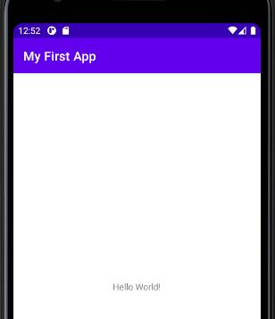
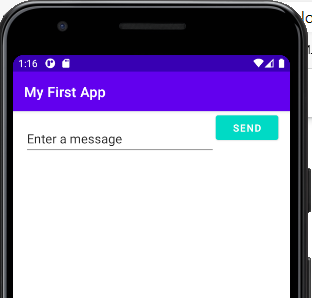
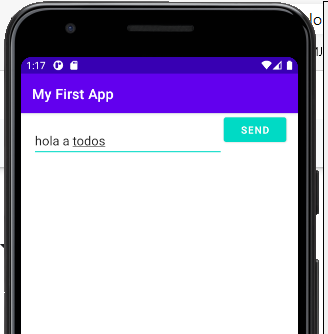
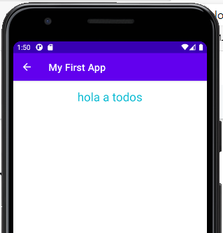
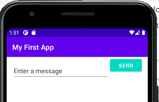

# Android

# 11 BUILD YOUR FIRST APP - ANDROID

Innovación Y Emprendimiento Con Tecnologías De La Información 2021-1

## Generalidades

Este repositorio presenta el laboratorio de IETI, usando las herramientas AndroidStudio, Git y Kotlin para su desarrollo.

### Funcionalidades

First Build

Actividad Principal

Segunda Actividad

Final

## Construido con

* [Android Studio](https://developer.android.com/studio) - Entorno de Desarrollo Integrado
* [GIT](https://git-scm.com/) - Environment Version Control System
* [Kotlin](https://kotlinlang.org/) - Lenguaje de Programacion

## Sobre el autor

*Michael Ballesteros*

Apasionado por el desarrollo y la gestión de sistemas

## Licencia

Para más información de la licencia ver LICENSE.md

Para más proyectos, Sígueme y encuentra mis repositorios :D
